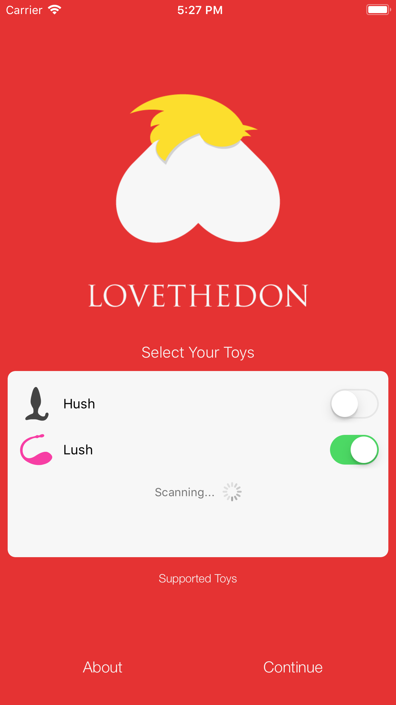
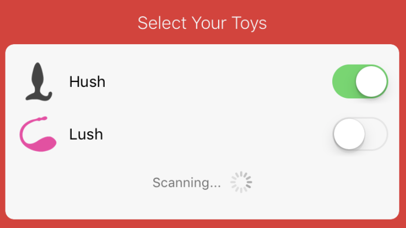
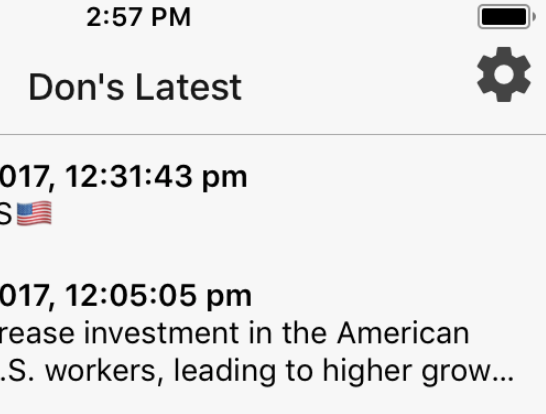
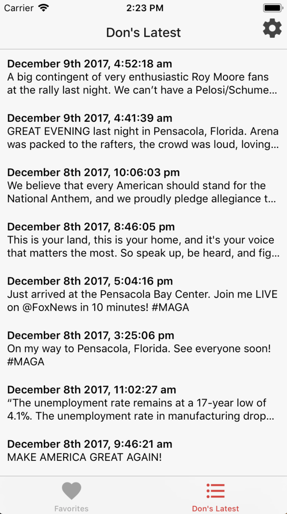
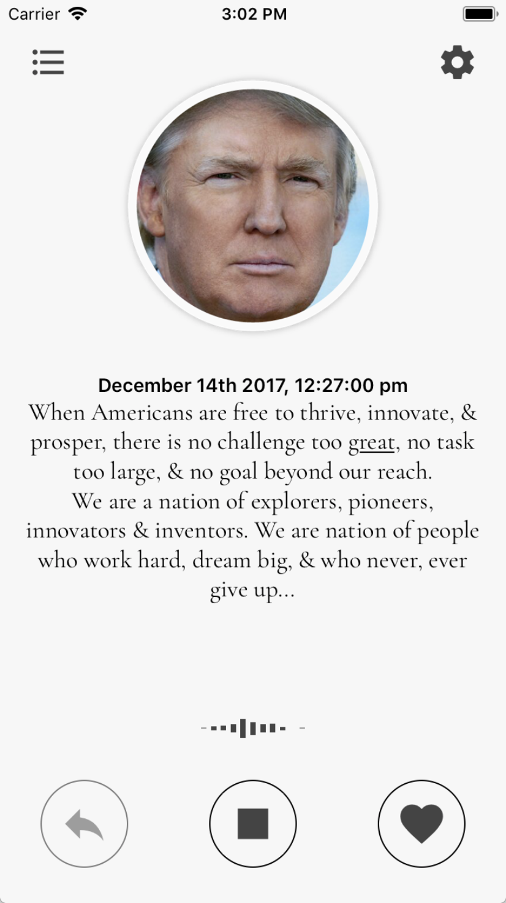
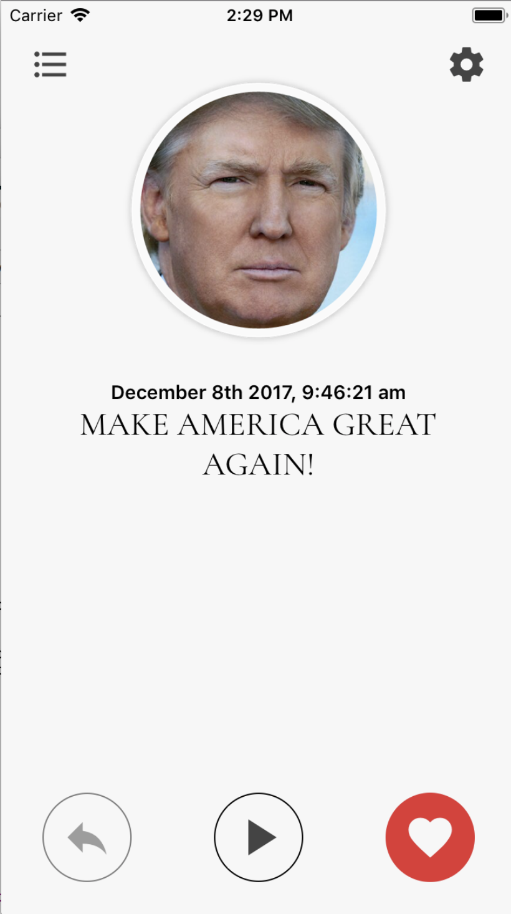
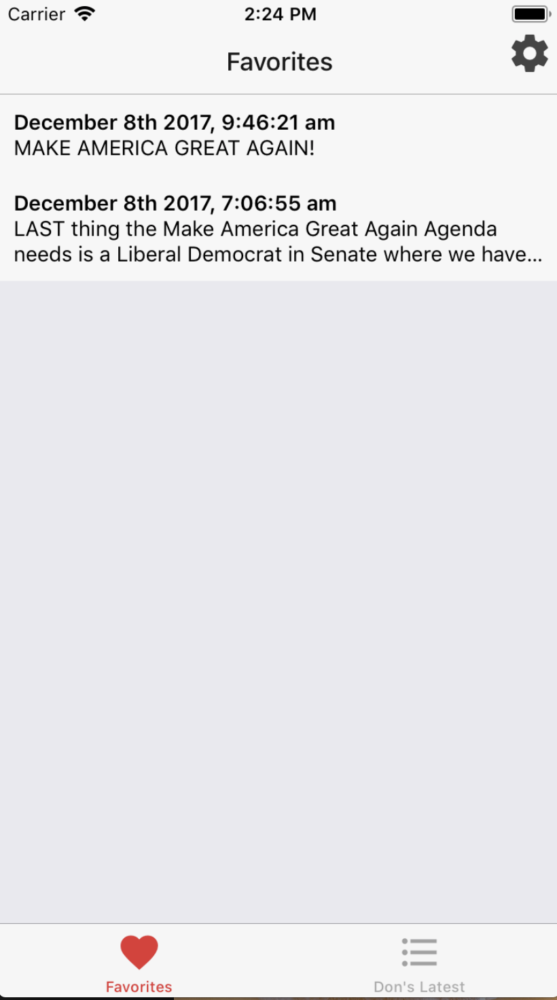
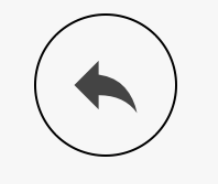
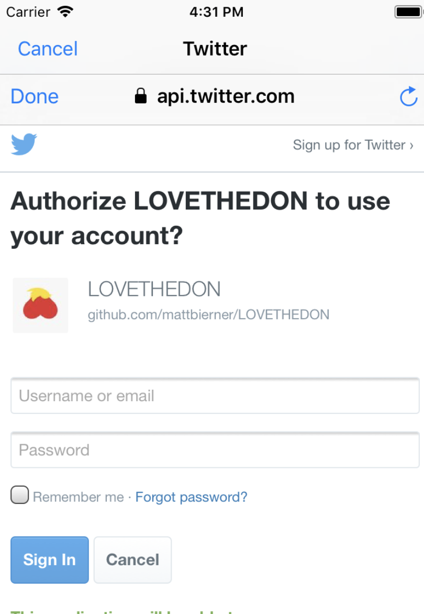
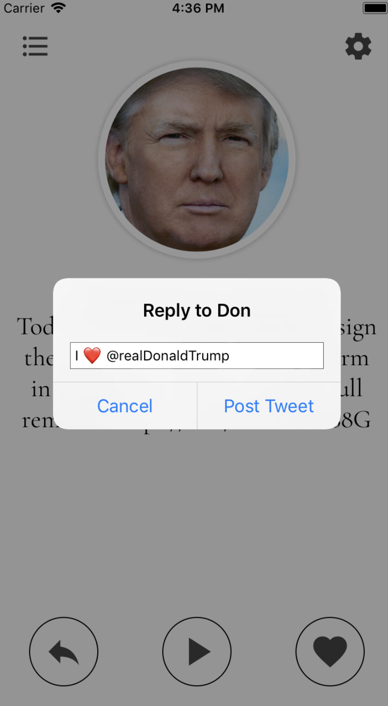

	

**Links**
- [Download in the App Store][appstore]
- [Report an issue][issues]

Connect with your President in a whole new way. Lay back and let Don show you how its done as the app translates his sweet twitter love poetry into vibrations for your favorite toy.

Whether you are a long-time supporter or just Don-curious, this app is for you. Don is fighting hard for us, so let's show him just how much we love him. It's time to start loving again. Loving like never before!

# Setup

To get started, first enable bluetooth and connect one or more [supported toys](#supported-toys):

	

Once you add a toy, it should reconnect automatically whenever it is powered on and in range.

You can also manage toys by tapping the gear icon in top right corner of the app:

	

# Supported Toys

- [Lovense](https://www.lovense.com/) Lush vibrator
- [Lovense](https://www.lovense.com/) Hush vibrator

*<i>Love The Don</i> is not affiliated with or endorsed by any toy manufacturers*

# Playback

The main screen shows a list of Don's latest tweets:
    

	

Tap on a tweet to open it. Then tap the play arrow to play it back:

	

Vibration strength and patterns are based on the phonetics of each word. Be on the lookout for special words or phrases that feature unique vibration patterns.

# Favorites

Enjoy a tweet? Save it to your favorites so that you can quickly return to it whenever the mood strikes!

Tap the ❤️ icon to save the current tweet to your favorites:

	

Browse and manage your favorites from the "Favorites" view:

	

# Sharing

Want to share your love of Don with the world? After playing through a tweet, just tap the arrow icon to post on Twitter:

	

If you haven't logged in yet, this will bring up a Twitter login screen:

	

After logging in, you will see a preview of the reply that will be posted. Hit 'Reply' to post the reply message to Twitter, letting Don know just how much we love him.

	

# Links
- [Download in the App Store][appstore]
- [Report an issue][issues]

 
 
 
 
 

*(love everyone)*

[appstore]: https://example.com
[issues]: ./issues